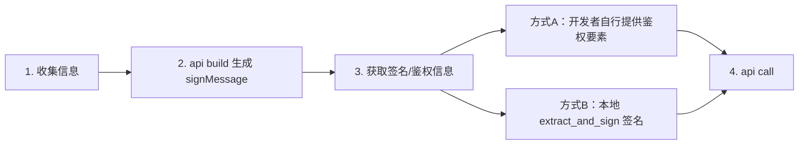

# APIv3 接口动态排障

## 前置依赖

进入本流程前，须确认 **`wechatpay-dev-cli` 已安装且可用**（安装详见 [wechatpay-dev-cli使用说明](./wechatpay-dev-cli使用说明.md)）。

1. **校验 CLI**：执行 `wechatpay-dev-cli --version`，能正常输出版本号（如 `1.0.0`）再继续。
2. **未安装时**：按使用说明安装（公网 `npm install -g @tenpay/wechatpay-dev-cli`），安装后再次执行 `--version` 确认。

校验通过后再执行后续的流程。

## 流程



### 核心约定（流程编排，勿写入脚本输出）

| 步骤 | 职责 |
|------|------|
| **Step 1 `api list`** | 确认 `mode`（merchant/partner）、接口ID 与查单参数，组装 `--params` JSON |
| **Step 2 `api build`** | 用 Step 1 的 `--params` 生成 `signMessage`；缺参会报错，补全后重试；**Agent 从 CLI 输出的 JSON 中保存 `signMessage` 原文（禁止篡改）** |
| **Step 3 方式 A** | 开发者回传 `Authorization` 头，或 `serial_no` + `timestamp` + `nonce_str` + `signature` |
| **Step 3 方式 B** | 本机 `extract_and_sign` 对 Step 2 的 `signMessage` 签名，回传脚本结果 |
| **Step 4 `api call`** | **仅使用 Step 3 回传**的 `serial_no` / `timestamp` / `nonce_str` / `signature` 拼 `Authorization`；可与 Step 2 嵌入的 timestamp/nonce **不一致**（方式 A 常见） |

> 方式 B 须对 Step 2 的 `signMessage` **原样**签名，故回传的 `timestamp`/`nonce_str` 应与该串内一致。

### CLI 与参数约定

- 命令入口：`wechatpay-dev-cli`
- **模式**：`--mode merchant`（普通商户）或 `--mode partner`（服务商/合作伙伴）
- **业务参数**：`--params` 传 inline JSON 或 `@文件路径`（推荐 Windows 用 `@file`，避免 shell 剥引号）
- **输出**：`list` / `build` / `call` 默认输出 JSON
- **`api build` 示例**（`payment.QueryByOutTradeNo`，merchant）：

**macOS / Linux**：

```bash
wechatpay-dev-cli api build payment.QueryByOutTradeNo \
  --mode merchant \
  --params '{"path":{"out_trade_no":"20260101001"},"query":{"mchid":"1900007291"}}'
```

**Windows PowerShell**（用 `@file` 传参，一行；Agent 终端下 inline JSON 易报 `CLIXML`）：

```powershell
[IO.File]::WriteAllText("$env:TEMP\wechatpay-params.json",'{"path":{"out_trade_no":"20260101001"},"query":{"mchid":"1900007291"}}'); wechatpay-dev-cli api build payment.QueryByOutTradeNo --mode merchant --params "@$env:TEMP\wechatpay-params.json"
```

## Step 1: 收集 API 请求信息

### 1.1 确认身份类型

请开发者确认身份（二选一）：

- **普通商户** → `--mode merchant`
- **合作伙伴（服务商）** → `--mode partner`

> **勿泛化收集**：不要提前索要 `mchid` / `sp_mchid` / `sub_mchid`；先确定要排查的**接口ID**，再按 1.3 脚本输出逐项收集。

### 1.2 查询接口目录

在 1.1 确定 `--mode` 后，列出当前身份下支持的查单接口，供开发者选择要排查的接口ID：

```bash
wechatpay-dev-cli api list --mode <merchant|partner>
```

将 CLI 输出的接口列表展示给开发者，由其选定一个 **接口ID**（如 `payment.QueryByOutTradeNo`）。

### 1.3 查询接口所需参数并收集

针对选定的接口ID，查看该接口在对应 `mode` 下需要填写的 Path / Query 参数：

```bash
wechatpay-dev-cli api list <接口ID> --mode <merchant|partner>
```

根据 CLI 输出 JSON 中的 `parameters` 字段（`in=path` / `in=query` 且 `required=true`），向开发者**逐项**索要实际值，并组装为 `--params` JSON（path 参数放 `path`，query 参数放 `query`）。参数是否齐全在 Step 2 的 `api build` 中校验——缺参时 CLI 会报错（如 `错误: 缺少必填参数: mchid`），按提示补全后重试即可。

---

## Step 2: 生成待签名串（`api build`）

Agent **在本地执行** `api build`（使用 Step 1 组装的 `--params`，传参方式见「CLI 与参数约定」），从 CLI 输出的 JSON 中读取并保存 **`signMessage` 原文**（**禁止篡改**）。若报缺参错误，回到 Step 1.3 向开发者补要对应字段后重试：

```bash
wechatpay-dev-cli api build <接口ID> \
  --mode <merchant|partner> \
  --params '<JSON>'
```

CLI 输出示例：

```json
{
  "id": "payment.QueryByWxTradeNo",
  "mode": "merchant",
  "signMessage": "GET\n/v3/pay/transactions/id/4200003100202606015015753674?mchid=1900007291\n1554208460\n593BEC0C930BF1AFEB40B4A08C8FB242\n\n",
  "timestamp": "1554208460",
  "nonce_str": "593BEC0C930BF1AFEB40B4A08C8FB242"
}
```

---

## Step 3: 获取签名 / 鉴权信息

### Step 3 开场话术

```text
Step 2 完成，待签名串已生成。

---

Step 3：获取签名值

请选择一种方式：

【方式 A】你已有签名结果，请任选一种回传：

  1) 完整 Authorization 请求头（推荐）
     示例：Authorization: WECHATPAY2-SHA256-RSA2048 mchid="1900007291",nonce_str="593BEC0C930BF1AFEB40B4A08C8FB242",signature="...",timestamp="1554208460",serial_no="408B07E79B8269FEC3D5D3E6AB8ED163A6A380DB"

  2) 分别提供以下 4 项（与请求头中字段一致）：
     · API 证书序列号（serial_no）
     · 时间戳（timestamp，秒级 Unix 时间）
     · 随机串（nonce_str）
     · 签名值（signature，Base64）

【方式 B】还没有签名
     我将提供一条可在本机终端执行的命令；执行后，把输出里「签名结果开始」到「签名结果结束」之间的内容整段复制回传即可。
```

> **流程约束**：Step 3 未拿到签名 / 鉴权信息前，不得进入 Step 4。

### 方式 A：开发者自行提供

- **选项 1**：原样粘贴完整 `Authorization` 请求头。
- **选项 2**：分别提供 **API 证书序列号、时间戳、随机串、签名值**（对应 `serial_no`、`timestamp`、`nonce_str`、`signature`）。
- **禁止**对开发者说「四元组」「鉴权四元组」等术语。
- 回传的 `timestamp` / `nonce_str` 可与 Step 2 串内值不一致；Step 4 **只使用 Step 3 回传值**。
- **不输出**本地脚本。

### 方式 B：本地 `extract_and_sign`

开发者选择方式 B 时：

- **只输出一个命令代码块**（可选一句「请在本机终端执行」）；收尾说明：**将终端里「签名结果开始」到「签名结果结束」之间的内容整段复制回传**。
- **禁止**：附「执行步骤」列表；在对话中出现「P12」「证书路径」「终端会提示输入密码」等；向开发者索要真实证书路径。

拼接规则：

| 参数 | Agent 如何填写 |
|------|----------------|
| `--signString` / `-SignString` | Step 2 保存的 `signMessage` 原文（单引号包裹） |
| `--filePath` / `-FilePath` | 占位路径 `/path/to/apiclient_cert.p12` 或 `C:\path\to\apiclient_cert.p12` |
| `--password` / `-Password` | Step 1 的 `mchid`（merchant）或 `sp_mchid`（partner） |

**macOS / Linux 示例**（`mchid=1900007291`）：

```bash
bash <SKILL目录>/scripts/bash/extract_and_sign.sh \
  --filePath "/path/to/apiclient_cert.p12" \
  --password "1900007291" \
  --signString 'GET\n/v3/pay/transactions/id/4200003100202606015015753674?mchid=1900007291\n1554208460\n593BEC0C930BF1AFEB40B4A08C8FB242\n\n'
```

**Windows 示例**（若报编码相关 `ParserError`，改用 `pwsh` 重试）：

```powershell
powershell -ExecutionPolicy Bypass -File "<SKILL目录>\scripts\powershell\extract_and_sign.ps1" `
  -FilePath "C:\path\to\apiclient_cert.p12" `
  -Password "1900007291" `
  -SignString 'GET\n/v3/pay/transactions/out-trade-no/202606021034379036?mchid=1900006891\n1780912534\n05E839355D63BAB809D98A41D6210F24\n\n'
```

Agent 从开发者回传内容中，在 **「签名结果开始」与「签名结果结束」** 标识之间提取下列字段，供 Step 4 使用：

| 终端行前缀 | 用途 |
|------------|------|
| `API 证书序列号（serial_no）:` | Step 4 `--serial_no` |
| `时间戳（timestamp）:` | Step 4 `--timestamp` |
| `随机串（nonce_str）:` | Step 4 `--nonce_str` |
| `签名值（signature）:` | Step 4 `--signature` |
| `API 证书中的商户号:` | Step 4.1 与 Step 1 商户号比对 |

### 方式 B 预期输入（开发者从终端复制回传）

开发者在本地执行方式 B 命令后，终端打印类似以下内容；**复制「签名结果开始」到「签名结果结束」整段回传给 Agent**：

```
---------- 签名结果开始 ----------
API 证书序列号（serial_no）: 408B07E79B8269FEC3D5D3E6AB8ED163A6A380DB
时间戳（timestamp）: 1554208460
随机串（nonce_str）: 593BEC0C930BF1AFEB40B4A08C8FB242
API 证书中的商户号: 1900007291
签名值（signature）: ...
---------- 签名结果结束 ----------
```

> 时间戳、随机串已包含在上述回传块内（与 Step 2 待签名串中一致），开发者**无需**单独回贴 JSON 中的 `timestamp` / `nonce_str` 字段。

---

## Step 4: 发起查询（`api call`）

### 4.1 证书商户号校验（方式 B）

比对 Step 1 收集的商户号与 **API 证书中的商户号** 是否一致：merchant 模式对 `mchid`；partner 模式对 `sp_mchid`（即服务商商户号）。

### 4.2 发起 api call

`--mode`、`--params`（传参方式见「CLI 与参数约定」）与 Step 1 / Step 2 相同；`--mchid`、`--serial_no`、`--timestamp`、`--nonce_str`、`--signature` 一律取自 Step 3 回传。响应为 JSON，解析 `status` 与 `body` 分析结果。

```bash
wechatpay-dev-cli api call <接口ID> \
  --mode <merchant|partner> \
  --mchid "<Authorization 中的 mchid>" \
  --params '<JSON>' \
  --serial_no "<Step3>" \
  --timestamp "<Step3>" \
  --nonce_str "<Step3>" \
  --signature "<Step3>"
```
